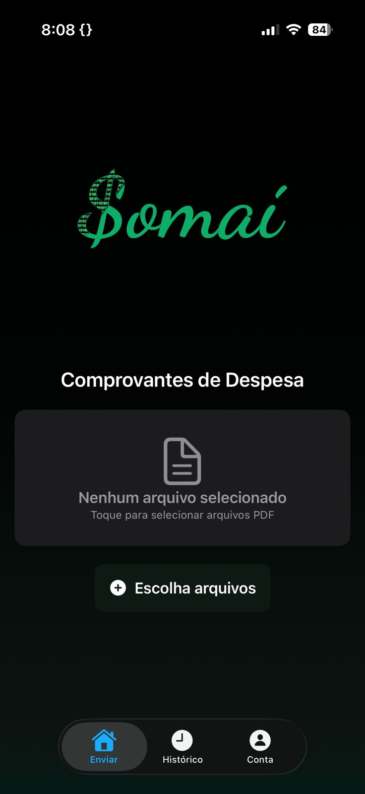
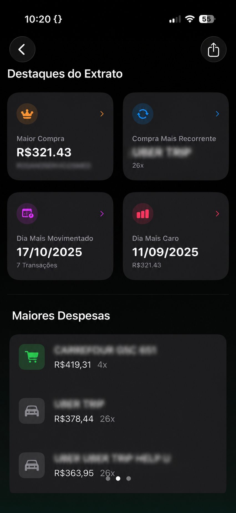
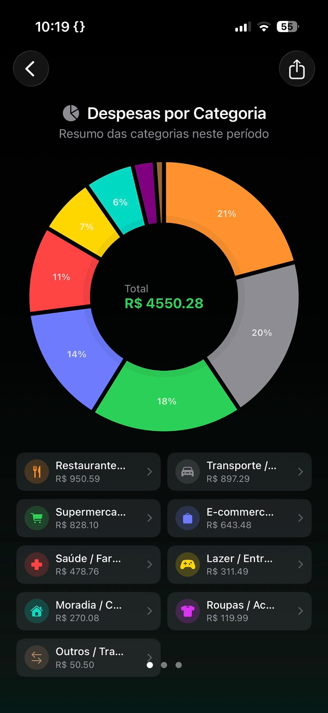
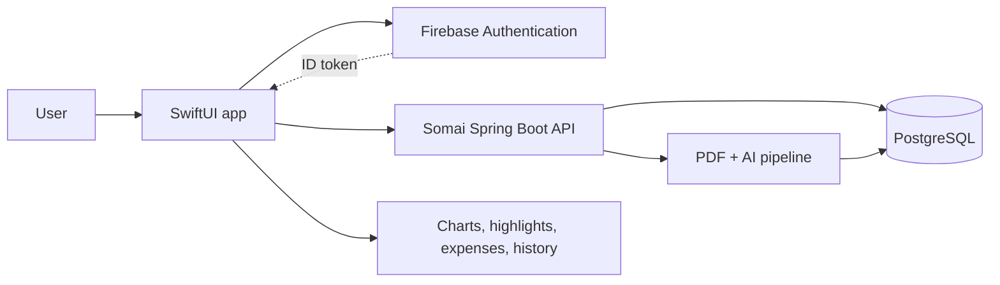

  

<h1 align="center">Somai for iOS</h1>

  <strong>Private expense insights from PDF statements, designed for iPhone.</strong>

Somai turns scattered expense statements into a clear financial story. The native iOS experience combines secure sign-in, multi-PDF upload, report history, category analysis, spending highlights, detailed expenses, and CSV export in a focused SwiftUI interface.

**[Explore the web experience](https://somai.renatoxico.net)** · **[View the API and web repository](https://github.com/Renatoxico/ExtractAPI)**

## Product experience

  
  
  

## What I built

I designed and built the native client as one surface of the wider Somai product, carrying the same account-private reports and visual language from web to iPhone.

- A SwiftUI workflow for selecting and uploading multiple PDF statements
- Email/password and Google sign-in through Firebase Authentication
- Bearer-token integration with the shared, versioned Spring Boot API
- Report history and account-scoped retrieval across sessions
- Interactive category charts, highlights, grouped expenses, and drill-down views
- CSV export and the iOS share sheet for taking structured data elsewhere
- A share extension for bringing documents into the processing flow
- Explicit loading, authentication, premium-access, network, and decoding states

## Architecture

## Technology

| Area | Technology |
| --- | --- |
| Interface | SwiftUI |
| Authentication | Firebase Auth, Google Sign-In |
| Networking | URLSession, async/await, authenticated REST |
| Visualization | Charts / DGCharts, native SwiftUI components |
| Document flow | Security-scoped files, multipart upload, share extension |
| Shared platform | Java 21, Spring Boot, PostgreSQL, Flyway, Gemini, Docker |

## Product family

- **This repository** contains the native Somai iOS experience.
- **[Somai API and web](https://github.com/Renatoxico/ExtractAPI)** contains the backend, Svelte application, data pipeline, tests, and production delivery workflow.
